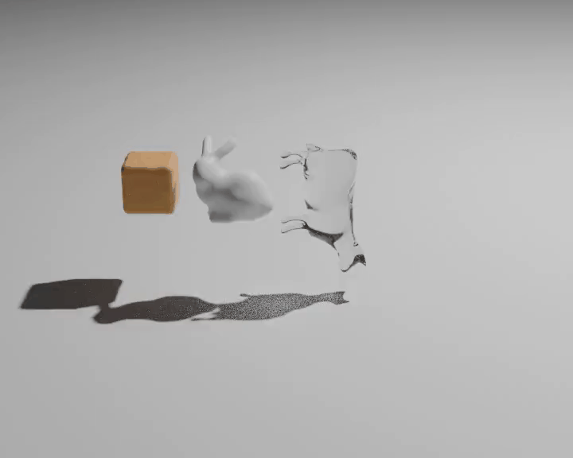

example:

```bash
python simulate.py --visualize --simulation_steps=20000 --scenario='Flood'
```

```bash
python simulate.py --visualize --simulation_steps=20000
```

## Examples
Below, we showcase several scenarios in `.gif` format. For better quality, we recommend viewing the original `.mp4` files in the `videos` folder.

### Fluid-Fluid Coupling


### Fluid-Solid Coupling


### Solid-Solid Coupling

In this example, two balls with different Young's Moduli collide. The Young's Modulus values are `1e3` for the left ball and `1e4` for the right ball.


As shown in the video below, the left ball deforms significantly more than the right ball due to its lower Young's Modulus.


### Complex Geometry

Users can import any point cloud files in the `.ply` format into the simulation framework. These files can be converted from `.obj` trimesh files using the script `data/obj2ply.py`.



## Features Checklist

- Basic Types
  - [ ] Rigid Body
  - [x] Deformable Body
  - [ ] Cloth
  - [x] Fluid
  - [x] Elastoplastic Objects
- Coupling
  - [ ] Solid-Solid
  - [ ] Solid-Fluid
  - [ ] Solid-Cloth
  - [ ] Fluid-Fluid
  - [ ] Fluid-Cloth
  - [ ] Cloth-Cloth
- Geometry
  - Trivial Geometry
    - [x] Cube
    - [x] Ball
    - [ ] ...
  - [x] Complex (mesh based or equation based) geometry
- Acceleration (Need to analysis the bottleneck and prove your acceleration ratio)
  - [ ] Algorithm acceleration
  - [ ] Multi-thread acceleration
  - [ ] GPU acceleration
- Control
  - [x] Customized scene configuration
    - Can use config files to customize scene configuration.
  - [ ] Interactive scene
- Rendering
  - [x] Now use Blender to render